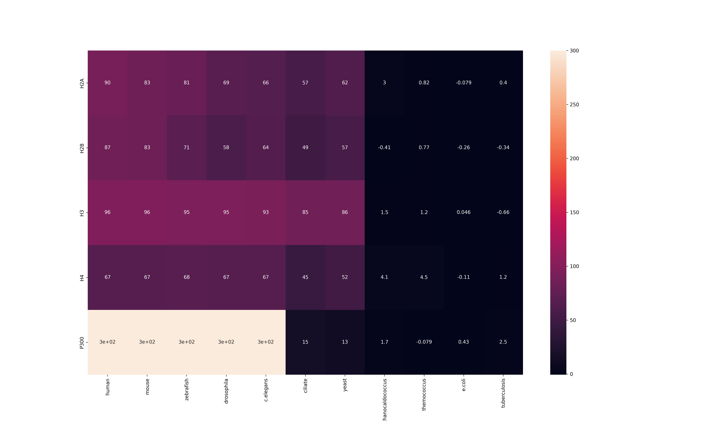

# P300 study

## Intro

EP300 is a histone acetyltranspherase p300 encoding gene. This protein is capable of H3K27ac epigenomic modification. It influences the growth and the devision of cells, their proliferation. Damage to the encoding gene can lead to different types of cancer, also to the syndrome of Rubinstein–Taybi syndrome.

Connection with our modification: Martire S, Nguyen J, Sundaresan A, Banaszynski LA. Differential contribution of p300 and CBP to regulatory element acetylation in mESCs. BMC Mol Cell Biol. 2020 Jul 20;21(1):55. doi: 10.1186/s12860-020-00296-9. PMID: 32690000; PMCID: PMC7370441.

P300 can activate transcription by binding to multiple transcription factors (p53, c-Myc, NF-κB), form IFN beta enhancosome, interact with the complex of chromatine remodelling SWI/SNF for acetyl appending.

It's expressed mostly in the bone marrow, testicules, ovaries, thyroid, appendix.

It consists of Taz1/CH1, IHD, Kix, Taz2/CH3, and IBiD domains.

## Alignment of histone subunits

Alignment results can be found in h2a_al.txt, h2b_al.txt, h3_al.txt, h4_al.txt files. We can see that alignments of h2b, h3 and h4 are very similar, so it seems that these subunits variations are encoded by very similar copies of one gene. Small changes don't lead to protein functional change, as the aminoacids can be quite similar between each other and have same behaviour (eg hydrophobic or hydrophylic). 

Meanwhile, in h2a subunit the variation is vast, some of the isoforms have regions that others don't have at all. This leads us to doubt that they are encoded by the copy of one gene, more likely several ones, which duplicated the original gene once and then collected mutations over millions of years, but large variation is also possible thanks to alternative splicing. Still, H2A is not one protein, but a family of proteins, which can be quite different, eg conventional H2A subunits and such ones as MACROH2A, which is more repressive for transcription and participates in X chromosome inactivation.

## Heatmap

## Results

We see that our p300 appeared in the evolution very early, practically along with histones. Although it has lower score (-ln(e-value)) in ciliate and yeast, it still seems that they have something very similar to it. We know that bacterias don't have histones, and their score is lower than 1 practically for all - that will be over lower edge. Meanwhile thermococcus has some histone-similar proteins and its max score is 4.1 for histones - upper edge. Then, in tuberculosis score for P300 is 2.5 and in methanocaldococcus 1.7 - somewhere between the edges, we can't say for sure how much what was found was P300-similar or not, but it may be probable it still is. 

Definetely we can only say that the standard P300 version is present since C. elegans. This also was confirmed during manual check, since C. elegans has CBP-1 which has the same functionality and is so close that the family of these proteins is named p300-CBP coactivator family.

Meanwhile, in yeast and ciliate there are similar proteins with acetyltranspherase activity and bromodomain, but they are more than 10 times smaller than original p300.
